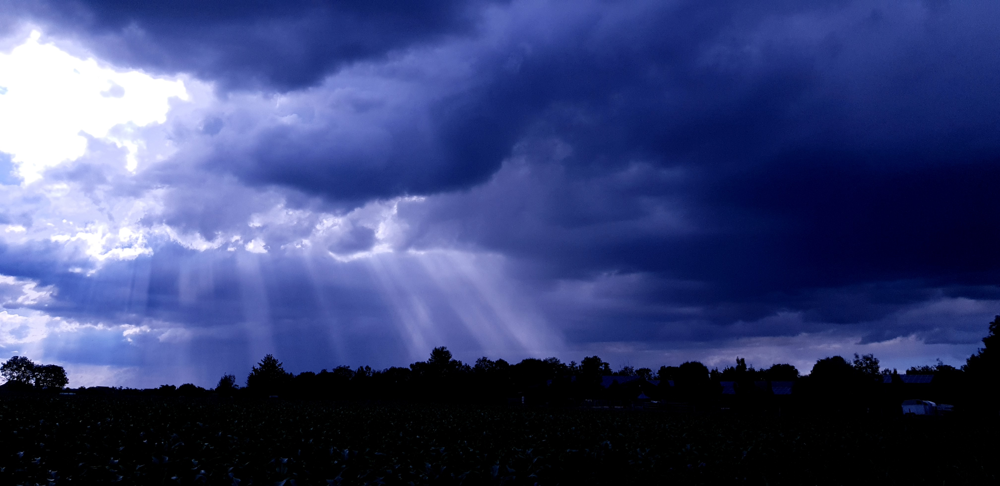

# ✨ Welcome to my profile! ✨

### 20-year old aspiring programmer

And this is my little space where I share my software projects and workbench codes in, or where I sometimes work on things with friends.

## How things started...

Back when I joined an institute called [PIAIC](https://www.piaic.org/), I first came in contact with programming through an AI course, where I developed a strong interest in the field and discovered my passion for learning how software works.

Following that, I started my BS in IT, where I learned [C++](https://isocpp.org/) and other fundamental programming languages, which helped me build a solid foundation in programming concepts and problem-solving.

Over time, I focused mainly on [Python](https://www.python.org/) and [C#](https://dotnet.microsoft.com/en-us/languages/csharp) as my core languages. I also developed a strong interest in Artificial Intelligence and continue to explore it further. Along the way, I gained experience working with tools and technologies such as [NumPy](https://numpy.org/), [Pandas](https://pandas.pydata.org/), [TensorFlow](https://www.tensorflow.org/), [Keras](https://keras.io/), [Bootstrap](https://getbootstrap.com/), [ASP.NET](https://dotnet.microsoft.com/apps/aspnet), Windows Forms, and other .NET technologies.

Over the years until now, I spend a good portion of my free time programming as a form of self-development, working on small projects that mainly serve for testing out what a programming language can do and trying different things out.

## Other Stuff I Do

Besides programming, activities that dominantly take up my time are chess and gardening. I also enjoy trying new things, such as game development using [Godot](https://godotengine.org/), and continuously explore different fields to broaden my knowledge and skills.

